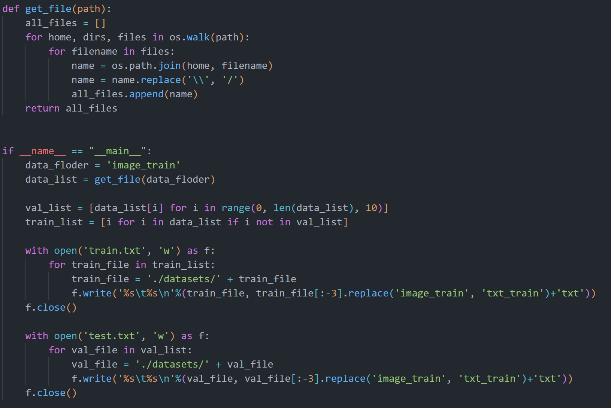

# 数据预处理

下载解压后将训练集和测试集文件拷贝至DBNet.pytorch/datasets文件夹中。

在本文中我们将利用基于ichar2015.yaml的icdar2015_resnet18_FPN_DBhead_polyLR.yaml模型，所以需要将数据处理成ICDAR2015格式，DBNet.pytorch/README.md文件中有说明数据格式。当然也可以使用open_dataset.yaml的模型，此时需要把数据处理成josn格式。

我们将原始训练集分为训练集和验证集，使用留出法划分为验证集：训练集 = 1：9。


数据处理脚本可以使用DBNet.pytorch/dataset/data_process.py进行，可以读取文件夹内的图片名称并进行转换。



# 模型设置

修改config/icdar2015_resnet18_FPN_DBhead_polyLR.yaml 配置文件

```

arch:
  type: Model
  backbone:
    type: resnet18
    pretrained: true

```

使用预训练模型pretrained: true，训练收敛会快一点

学习率设置:

```

optimizer:
  type: Adam
  args:
    lr: 0.001        # batch size(所有GPU上的batch size总和)大的话调大点，小的话则调小点
    weight_decay: 0  # L2正则化权重衰减参数，可以使用1e-4
    amsgrad: true
lr_scheduler:
  type: WarmupPolyLR # 权重衰减
  args:
    warmup_epoch: 3

```

迭代次数设置：

```
trainer:
  seed: 2
  epochs: 120
  log_iter: 10
  show_images_iter: 50
  resume_checkpoint: ''   # 重新中断之前的训练，这里写上重新训练的文件名
  finetune_checkpoint: '' # 微调已经训练好的模型
  output_dir: output
  tensorboard: false      # tensorboard可视化，这个用不用无所谓，如果要检测损失值变化可以使用


```


# 模型训练

> 以ResNet18+FPN+DBNetHead为例


单核训练时使用：

```
CUDA_VISIBLE_DEVICES=0 python3 tools/train.py --config_file "config/icdar2015_resnet18_FPN_DBhead_polyLR.yaml"  # 单GPU训练

```

多核训练时使用：

```

export NGPUS=4  # 依据自己电脑配置修改GPU数量，下行中的CUDA_VISIBLE_DEVICES也要同步修改
CUDA_VISIBLE_DEVICES=0,1,2,3 python3 -m torch.distributed.launch --nproc_per_node=$NGPUS tools/train.py --config_file "config/icdar2015_resnet18_FPN_DBhead_polyLR.yaml"  # 多GPU训练

```

**注意单核与多核不能同时训练**


# 模型测试

利用eval.py对训练出来的模型进行测试看看效果：

```

CUDA_VISIBLE_DEVICES=0 python3 tools/eval.py --model_path '（训练出来的模型的位置）'

```


# 结果预测

修改tools/predict.py文件，注释下面两行，不注释的话会输出具有标注框的图像：

```

        # 保存结果到路径
        os.makedirs(args.output_folder, exist_ok=True)
        img_path = pathlib.Path(img_path)
        output_path = os.path.join(args.output_folder, img_path.stem + '_result.jpg')
        pred_path = os.path.join(args.output_folder, img_path.stem + '_pred.jpg')
        #cv2.imwrite(output_path, img[:, :, ::-1])
        #cv2.imwrite(pred_path, preds * 255)
        save_result(output_path.replace('_result.jpg', '.txt'), boxes_list, score_list, args.polygon)


```

修改util/util.py文件，只保存四个顶点坐标即可，不需要置信度：

```

def save_result(result_path, box_list, score_list, is_output_polygon):
    if is_output_polygon:
        with open(result_path, 'wt') as res:
            for i, box in enumerate(box_list):
                box = box.reshape(-1).tolist()
                result = ",".join([str(int(x)) for x in box])
                score = score_list[i]
                res.write(result + ',' + str(score) + "\n")
    else:
        with open(result_path, 'wt') as res:
            for i, box in enumerate(box_list):
                score = score_list[i]
                box = box.reshape(-1).tolist()
                result = ",".join([str(int(x)) for x in box])
                #res.write(result + ',' + str(score) + "\n")
                res.write(result + "\n")  # 加上这一句


```

测试代码：

```

CUDA_VISIBLE_DEVICES=0 python tools/predict.py --model_path model_best.pth --input_folder ./input --output_folder ./output --thre 0.7 --polygon --show --save_result
```

其中--polygon表示输出多边形框的参数，天池竞赛中要求输出矩形框的坐标参数，因此在最后的输出过程中不需要该参数。
